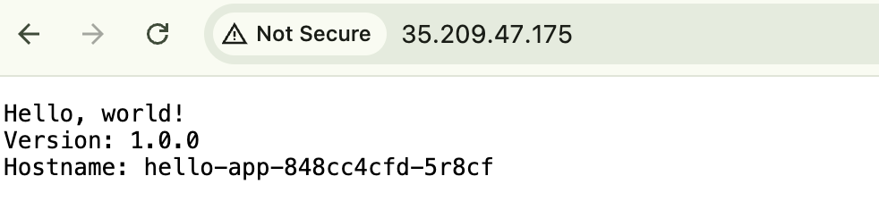
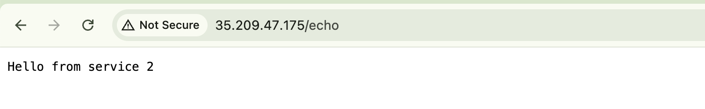
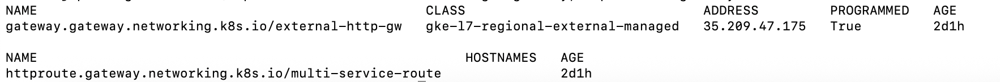

# apigateway-lab

A small demo that provisions a Namespace, two sample apps (hello-app and echo-v2),
a GKE managed HTTP Gateway and two HTTPRoutes that expose those services.

Quick overview of resources in this repo:
- Namespace: [`gateway-demo.Namespace`](k8s/01-namespace.yaml) — defined in [k8s/01-namespace.yaml](k8s/01-namespace.yaml)
- hello-app Deployment & Service: [`hello-app.Deployment`](k8s/02-hello-app.yaml), [`hello-svc.Service`](k8s/02-hello-app.yaml) — defined in [k8s/02-hello-app.yaml](k8s/02-hello-app.yaml)
- Gateway (GKE L7 managed): [`external-http-gw.Gateway`](k8s/03-gateway.yaml) — defined in [k8s/03-gateway.yaml](k8s/03-gateway.yaml)
- HTTPRoute for hello-app: [`hello-route.HTTPRoute`](k8s/04-httproute.yaml) — defined in [k8s/04-httproute.yaml](k8s/04-httproute.yaml)
- echo-v2 Deployment & Service: [`echo-v2.Deployment`](k8s/05-second-app.yaml), [`echo-v2.Service`](k8s/05-second-app.yaml) — defined in [k8s/05-second-app.yaml](k8s/05-second-app.yaml)
- Multi-service HTTPRoute (traffic split): [`multi-service-route.HTTPRoute`](k8s/06-multi-service.yaml) — defined in [k8s/06-multi-service.yaml](k8s/06-multi-service.yaml)

Files and brief explanations
- k8s/01-namespace.yaml
  - Creates the Kubernetes Namespace (gateway-demo) used to group all demo resources.
  - Contains: Namespace manifest with metadata.name = gateway-demo.

- k8s/02-hello-app.yaml
  - Deploys the hello-app Deployment and exposes it via a Service (hello-svc).
  - Contains: Deployment spec (replicas, container image, ports) and a Service (ClusterIP) targeting the Deployment.

- k8s/03-gateway.yaml
  - Defines a Gateway resource (uses GKE's `gke-l7-regional-external-managed` GatewayClass).
  - Contains: Gateway spec with listeners (HTTP), parentRefs and annotations for the GKE-managed L7 load balancer.

- k8s/04-httproute.yaml
  - Routes HTTP traffic from the Gateway to the hello-svc Service.
  - Contains: HTTPRoute rules with path match(es) and backendRef(s) pointing to hello-svc:80.

- k8s/05-second-app.yaml
  - Deploys the echo-v2 application and a Service to expose it.
  - Contains: Deployment spec for echo-v2 and a Service (ClusterIP) that the HTTPRoute can target.

- k8s/06-multi-service.yaml
  - Demonstrates a single HTTPRoute that splits traffic between hello-svc and echo-v2.
  - Contains: HTTPRoute rules with backendRefs that include weights (e.g., hello-svc weight: 10, echo-v2 weight: 90).

Prerequisites
- kubectl configured to a GKE cluster with the Gateway API and the
  `gke-l7-regional-external-managed` GatewayClass available.
- Appropriate IAM / cluster permissions to create Gateways and Services.

Deploy
1. Apply all manifests:
   ```sh
   kubectl apply -f k8s/
   ```
   (This creates the namespace, deployments, services, gateway and routes.)

2. Verify resources:
   ```sh
   kubectl get namespace gateway-demo
   kubectl get deployments,svc -n gateway-demo
   kubectl get gateway -n gateway-demo
   kubectl get httproute -n gateway-demo
   ```

Test the gateway
1. Get the external IP assigned to the Gateway (may take a few minutes):
   ```sh
   kubectl get gateway external-http-gw -n gateway-demo -o jsonpath='{.status.addresses[0].value}'
   ```
   Save the returned IP as $GATEWAY_IP.

2. Curl the gateway:
   ```sh
   curl http://$GATEWAY_IP/
   ```
   - The `hello-route` sends traffic to `hello-svc`.
   - The `multi-service-route` demonstrates traffic splitting between `hello-svc` and `echo-v2`.

Notes
- The multi-service route uses weights (10/90) to illustrate splitting traffic between services.
- If the Gateway IP is not returned in status, check the Gateway controller logs and the GCP console for the managed load balancer.
- All YAML files are in the `k8s/` folder — see the list above.

Files
- README.md
- k8s/01-namespace.yaml
- k8s/02-hello-app.yaml
- k8s/03-gateway.yaml
- k8s/04-httproute.yaml
- k8s/05-second-app.yaml
- k8s/06-multi-service.yaml

Test results:

gateway results

Second Service 


kubectl get gateway,httpRoute -n gateway-demo
